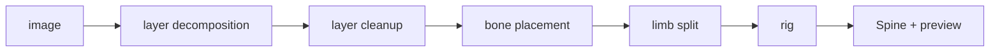
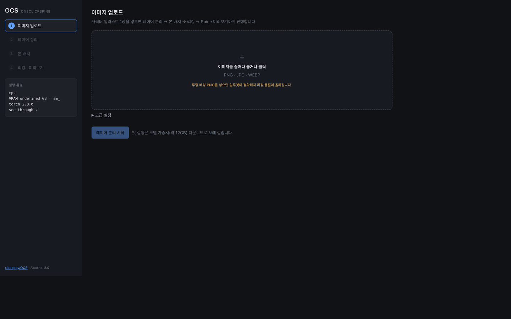
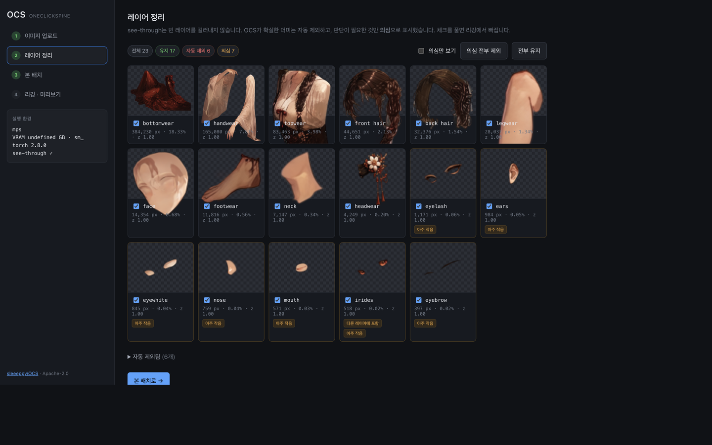
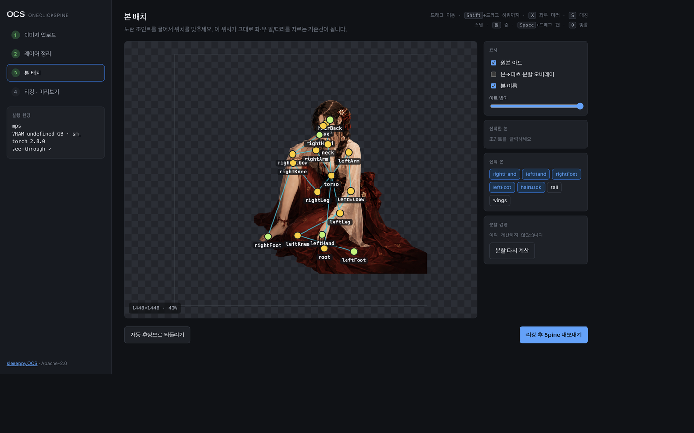
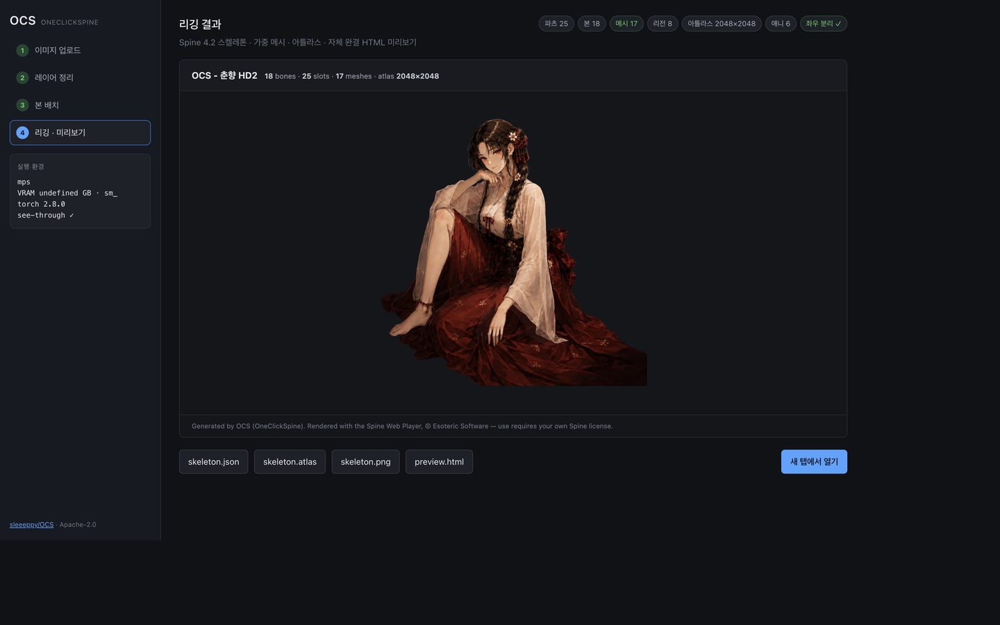

# OCS — OneClickSpine

**English** · [한국어](README.ko.md)

Turn one character illustration into a rigged, animated **Spine 4.2** skeleton.

Drop in a PNG. OCS decomposes it into layers, lets you drop dummy parts and place bones, then builds a weighted mesh rig, packs an atlas, and hands back a standalone HTML preview.



| 1. Upload | 2. Layer cleanup |
|:---:|:---:|
|  |  |
| **3. Bone placement** | **4. Rig & preview** |
|  |  |

<p align="center"><sub>Screenshots from a local test project.</sub></p>

Built on [see-through](https://github.com/shitagaki-lab/see-through) for layer decomposition (git submodule, Apache-2.0). [spine-animation-ai](https://github.com/GenielabsOpenSource/spine-animation-ai) was read as prior art and is **not** reused — see [NOTICE.md](NOTICE.md).

---

## Requirements

- [uv](https://github.com/astral-sh/uv), Python 3.12, git
- For layer decomposition: an NVIDIA GPU **or** Apple Silicon, plus ~20 GB free for model weights
- Everything after decomposition (cleanup, bones, rig, export, preview) also runs on CPU

| | |
|---|---|
| **NVIDIA** | 16 GB is comfortable; 8 GB works with group offload. Blackwell cards need CUDA 12.8 / torch `cu128`. |
| **Apple Silicon** | `./scripts/setup_env.sh --with-gpu`. Resolution is capped at **768** on MPS. Slower than a discrete GPU. |
| **No GPU** | The editor still works. Import a PSD or build a [demo project](#no-gpu). |

Helper scripts: `.ps1` for Windows, `.sh` for macOS / Linux.

## Setup

```bash
git clone --recurse-submodules https://github.com/sleeeppy/OCS.git
cd OCS
```

Windows:

```powershell
./scripts/setup_env.ps1
```

macOS / Linux:

```bash
./scripts/setup_env.sh              # editor only, no GPU — under a minute
./scripts/setup_env.sh --with-gpu   # + torch and see-through
```

`setup_env.ps1` fails if CUDA is missing (on Windows that usually means a broken install). `setup_env.sh` does not — GPU is only required for decomposition.

Optional, for previews that work offline. The Spine Web Player is **not** committed (redistribution is restricted; you need your own Spine license). Without this step, previews load the runtime from unpkg:

```bash
./scripts/fetch_spine_player.sh     # macOS / Linux
./scripts/fetch_spine_player.ps1    # Windows
```

## Run

```bash
./scripts/run_ocs.sh      # macOS / Linux
./scripts/run_ocs.ps1     # Windows
```

Then open <http://127.0.0.1:8765/>.

Use a **transparent-background PNG**. OCS can estimate a silhouette from a flat background, but a real cutout is the single biggest quality lever.

The first GPU run downloads ~12 GB of model weights. Later runs take a couple of minutes per image.

### Four steps

1. **Upload** — resolution, steps, and seed are under *Advanced*. Group offload is on by default (~10 GB VRAM). Leave it on for MPS.
2. **Layer cleanup** — dummy layers are dropped automatically; uncertain ones are flagged. Untick to exclude; auto-dropped layers can be restored.
3. **Bone placement** — drag the joints. `Shift`+drag moves the subtree, `X` mirrors left↔right, `S` snaps symmetric pairs, `0` fits the view.
4. **Rig & preview** — weighted meshes, atlas, `skeleton.json`, and a downloadable HTML preview.

`right` means the **character's** right (the viewer's left). Getting this backwards mirrors every animation.

## Output

```
workspace/projects/<id>/export/
  skeleton.json     Spine 4.2 — weighted meshes + preset animations
  skeleton.atlas    libgdx atlas
  skeleton.png      packed texture page
  preview.html      standalone (assets inlined as data URIs)
```

`idle` is exported by default — it works for any pose. `walk`, `wave`, `jump`, and `turn_head` assume a standing figure; pass `animations=[...]` to `export_skeleton` to include them.

## No GPU

Decomposition is the only stage that needs a GPU. If you already have see-through output, or want to iterate on later stages:

```bash
.venv/bin/python scripts/import_psd.py path/to/foo.psd
```

No PSD either — build a synthetic project and open the editor:

```bash
.venv/bin/python scripts/make_demo_project.py --all
./scripts/run_ocs.sh
```

## Tests

```bash
.venv/bin/python -m pytest tests -q          # macOS / Linux
.venv/Scripts/python.exe -m pytest tests -q  # Windows
```

## License

Apache-2.0. See [LICENSE](LICENSE) and [NOTICE.md](NOTICE.md). Using the Spine Web Player requires your own license from Esoteric Software.
